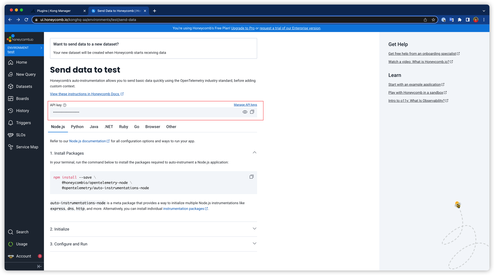

(pause: 1)


(font-size: 30)

```
使用OpenTelemetry插件来检查性能
```

本次视频演示了如何使用Open Telemetry插件对性能问题进行故障排除。

---

(pause: 1)


首先，创建一个指向测试API的Service。 这次我们使用一个名为HTTPBIN的HTTP请求和响应服务。设置Service的路径为/anything，这样我们就设置了一个echo的Service。


---

(pause: 1)


接下来，创建一个route，以便这个service可以被外部访问。

---

(pause: 1)


现在我们尝试使用Kong网关来访问httpbin服务。 向kong网关的8000端口发送请求，并且讲请求的路径指定为刚刚在route当中配置的/demo。

(pause: 1)

我们得到了一个200 的Response，所以配置似乎没有问题。

---

(pause: 1)


下一步，我们在Service层面上启用OpenTelemetry插件。这个插件会将请求的tracing信息发送到一个与OTLP兼容的服务器。

(pause: 1)

在这个演示中，我会使用HoneyComb作为OTLP服务器。如屏幕上所示，为了把Tracing信息发送到我的账户中，在OpenTelemetry插件的设置里需要添加一些Header信息。

---



如果你也想使用HoneyComb进行测试，你可以在HoneyComb的Dashboard上找到你的API key。

---

(pause: 1)


为了进行性能测试，让我们添加另一个插件，Route Transformer Advanced。 这个插件可以即时转换Kong的route，并改变Upstream API、port或者路径。在这个例子中，我们把路径改为/xml。

(pause: 1)

现在我们已经添加了这个插件，接下来我们想从tracing信息中看看延迟是否会增加。

---

(pause: 1)


继续发送请求，并将路径改为/xml，你将得到一些xml的response。

---

(pause: 1)


让我们来看看HoneyComb dashboard上的Tracing信息。点击单个请求的tracing条目，可以看到这个请求的每个阶段所花费的延迟时间。在这个例子中，你可以看到大部分时间都花在访问 upstream API上，在Route Transformer Advanced插件上只花了52微秒。

由此可知，OpenTelemetry插件是一个非常强大的工具。它所导出的tracing信息对运维人员来说是非常有帮助的，因为它可以让他们看到流程中每个阶段的性能。

今天的演示就到这里的。谢谢您的观看，我们下次再见。
